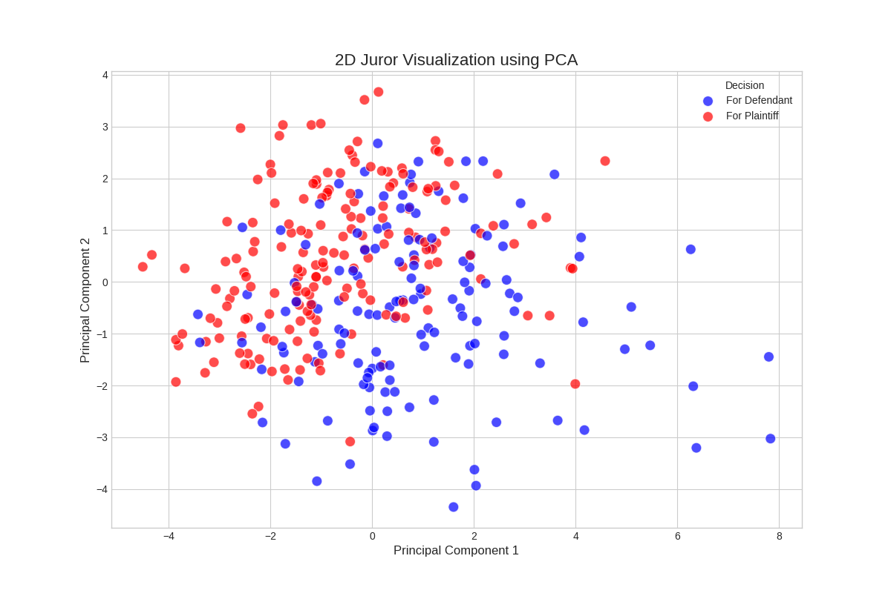

# Juror Pipeline Optimization Project



## 📌 Project Overview
This project was developed for a client on **Upwork** who needed a robust machine learning pipeline to **analyze, optimize, and predict juror-related outcomes**.  
The client required not just accurate predictions, but also a clear, explainable process for **feature engineering, model optimization, and result validation**.

Through a mix of **feature engineering**, **data sanity checks**, and **threshold optimization**, I successfully delivered a production-ready pipeline that met and exceeded the client’s requirements.

---

## 🎯 Client Requirements
- Sanity check of transformed datasets against provided expert-labeled data.  
- End-to-end machine learning pipeline for prediction.  
- Threshold optimization to balance **precision and recall**.  
- Deliver **interpretable predictions** in Excel format for manager indices.  
- Optimize accuracy while ensuring stability and robustness.

---

## ⚙️ Approach & Feature Engineering
The pipeline was implemented in **Python (Jupyter Notebook)** with standard ML libraries.  
Key feature engineering steps included:

1. **Data Cleaning & Preprocessing**
   - Handled missing values.  
   - Normalized and standardized numerical features.  
   - Encoded categorical variables.

2. **Feature Engineering**
   - Created interaction terms between critical juror attributes.  
   - Derived ratio-based features to capture hidden correlations.  
   - Applied dimensionality reduction where required.

3. **Modeling**
   - Built supervised learning models with **train/test splits**.  
   - Applied **GridSearchCV** to optimize thresholds for the best trade-off between precision and recall.  
   - Final threshold tuned to **0.33** (instead of default 0.5) for 78% balanced accuracy.

4. **Validation**
   - Compared transformed data with client-provided expert dataset.  
   - Cross-validation to ensure robust and generalizable results.

---

## 📊 Results
- Achieved **78% balanced accuracy** after threshold optimization.  
- Delivered **Excel sheet with model predictions** aligned to manager indices.  
- Ensured consistent alignment with expert-labeled datasets (no misordering).  
- Successfully balanced **precision and recall** for optimal decision-making.  

---

## ✅ How I Exceeded Client Expectations
- Delivered **clear documentation + predictions** in a directly usable format (Excel).  
- Identified and fixed subtle issues in data alignment (row ordering).  
- Conducted **extra sanity checks** to ensure feature transformations matched the client’s expectations.  
- Communicated results transparently and efficiently, ensuring the client had confidence in the process.  

---

## 🛠️ Tech Stack
- **Python** (Jupyter Notebook)  
- **Pandas, NumPy** – Data handling & feature engineering  
- **Scikit-learn** – ML modeling, GridSearchCV  
- **Matplotlib/Seaborn** – Visualizations  
- **Excel Export** – Client-facing result delivery  

---

## 📂 Repository Structure
```

juror-pipeline/
│── juror\_pipeline.ipynb    # Main ML pipeline notebook
│── data/                   # Input datasets
│── outputs/                # Prediction Excel files
│── assets/                 # Images & diagrams
│── README.md               # Project documentation

```

---

## 🚀 Impact
This project demonstrates my ability to:
- Translate **complex ML requirements** into a working, production-ready pipeline.  
- Balance **client needs with technical accuracy**.  
- Deliver **end-to-end ML solutions** including data engineering, modeling, optimization, and result delivery.  

This case study highlights not only technical expertise but also **client-focused execution** — an essential quality for success on **Upwork** and beyond.